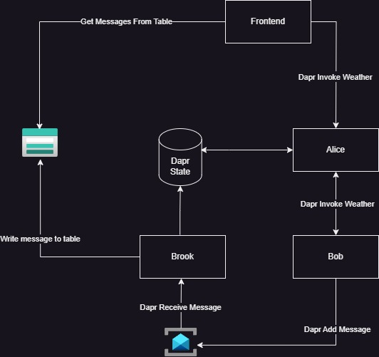

# .NET Aspire sample with Dapr

Voor de volgende opdracht heb ik me laten inspireren op basis van de volgende blog post.
> Read the associated blog post: [.NET Aspire is the best way to experiment with Dapr during local development](https://anthonysimmon.com/dotnet-aspire-best-way-to-experiment-dapr-local-dev/).

Het doel van de opdracht is om naast Aspire ervaring op te doen met Dapr. We gaan Dapr gebruik om ons de volgende onderdelen eigen te maken

- Pubsub
- State Management
- Resiliency

Het wordt een simpele applicatie waarmee we het weerbericht vanuit simpele api's door laten stromen waarbij we events publiceren en deze events ook weer gaan weggschrijven naar een table storage. Een overview van de end-state ziet er als volgt uit.

## Opdrachten)
De opdrachten nemen je stap voor stap mee in de opbouw van deze applicatie

- [Assignment 1](/workshop/step-1/step-1.md)
- [Assignment 2](/workshop/step-2/step-2.md)
- [Assignment 3](/workshop/step-3/step-3.md)
- [Assignment 4](/workshop/step-4/step-4.md)
- [Assignment 5](/workshop/step-5/step-5.md)
