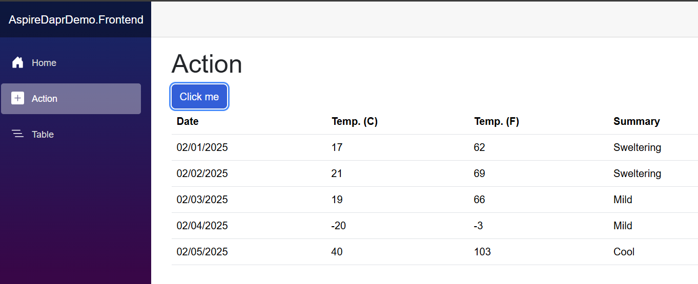

# Opdracht Gebruik van Dapr om Service aan te roepen
 
De 1ste opdracht bestaat uit het kunnen aanroepen van de eerste api om een weather request terug te krijgen vanuit de front-end op dit moment werkt namelijk precies niks enkel het openen van de pagina. Het doel is dat we iedere api gaan aanroepen middels de DaprClient en daarmee gebruik maken van de functionaliteit die Dapr te bieden heeft.

### Stap 1.1)
De eerste stap is dat alle projecten worden voorzien van een Dapr SideCar dit is nodig om te communicatie met de verschillende projecten te ondersteunen ipv de reference die we in het verleden hebben gebruikt. Gebruik de onderstaande toevoeging in het AppHost project. Let op er is nog iets extras nodig

```c#
WithDaprSidecar()
```

Na het toevoegen zou het aspire dashboard de nodige extra containers moeten laten zien.

### Stap 1.2)

De 2de stap is het toevoegen van de daprclient middels DI. Om dit voor alle projection beschikbaar te maken voegen we dit toe aan het service defaults projects. Let op hiervoor is de Nuget package `Dapr.AspNetCore` benodigd

```c#
builder.Services.AddDaprClient();
```

### Stap 1.3)

De volgende stap is het aanroepen van de BobService om een weatherforecast te ontvangen. Inject de daprclient in de Action razor `@inject DaprClient daprClient;` en haal de weatherforecasts op 

```c#
forecasts = await daprClient.InvokeMethodAsync<WeatherForecast[]>(HttpMethod.Get, "...", "...");
```

Dit zou het volgende resultaat moeten hebben:

