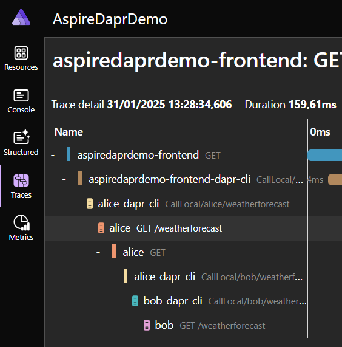
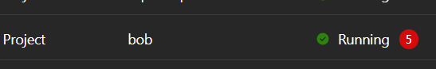

# Opdracht maak gebruik van een extra service en test resilience en statee

De 2 de opdracht bestaat uit het onderdeel dat we state gaan toevoegen aan de applicatie maar ook gaan kijken naar de resilience die Dapr te bieden heeft en hoe dat terug komt in de verschillende logging in het Aspire Dashboard. Dit betekent dat we een volgende stap met de applicatie en Allice er bij zetten als extra service.

### stap 2.1) 

Maak in de alice service een `GET` endpoint aan met de naam `weatherforecast` gebruik vervolgens de daprclient om de juiste service aan te roepen. Let op dat je niet vergeet de Front-End aan te passen.

Na het aanroepen van een request zou je de traces kunnen openen in het Aspire Dashboard hier zie je hoe de app met de sidecar praat en vervolgens de sidecar met de volgende en zo verder dit geeft een mooi inzicht hoe het mechanisme werkt.



### Stap 2.2)

Probeer in de volgende stap de resilency van dapr te testen doe dit door in de Bob app een error te creeeren hier een suggestie hoe dit te verwwezenlijken

```c#
// Simulating a flaky API in order to demonstrate Dapr's resilience features
if (Random.Shared.NextDouble() > 0.4)
{
    throw new InvalidOperationException("Something wrong happened");
}
```

Probeer de applicatie te runnen en kijken wat er nu gebeurd. Als het goed is zie je geen resilience in je applicatie terug komen simpelweg omdat dit niet geconfigureerd is. De onderstaande code lost dit op doordat er een resillience.yml wordt toegevoegd. Kijk eens naar de configuratie binnen dit bestand

```c#
.WithDaprSidecar(new DaprSidecarOptions
{
    // Loads the resiliency policy for service invocation from alice to bob
    ResourcesPaths = [Path.Combine("..", "resources")],
});
```

Na het uitvoeren met de bovenstaande feature geactiveerd zou je tot de conclusie moeten komen dat de App blijft werken maar zonder problemen door blijft gaan ondans de error's in de log



### Stap 2.3)

In deze stap willen we state toevoegen hoewel een fout een keer niet zo erg is, is het fijn om state te hebben en je resultaten terug te kunnen geven als ze niet te oud zijn. Gebruik hiervoor de volgende toevoeging. Koppel deze state store aan de juiste applicatie

```c#
builder.AddDaprStateStore("statestore");
```

Gebruik in de Alice service de volgende methodes om state op te halen en toe te voegen. Om het makkelijk te maken is er een class `CachedWeatherForecast`

```c#
daprclient.GetStateAsync(...)
daprclient.SaveStateAsync(...)
```

