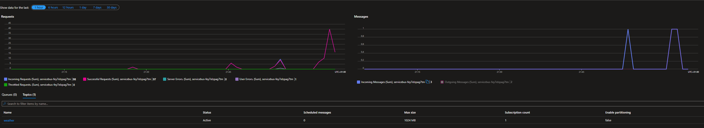

# Opdracht Deploy naar Azure

Deze opdracht is het deployen naar Azure. Op het moment dat het in Azure staat kijken hoe we de Dapr Components kunnen aanpassen door de components yaml aan te passen en naar een andere koppeling te schrijven.

### Opdracht 5.1)
De eerste stap zou vrij makkelijk moeten zijn namelijk deploy de applicatie middels 

```ps1
azd up
```

Als alles werkt zoals het zou moeten zou je een applicatie moeten kunnen openen waar alles werkt. Als je nu het aspire dashboard opent zou je de volgende traces kunnen verwachten waarbij de verwerking van het event het item in de tablestorage aanmaakt:


Naast de traces kun je ook de table bekijken middels de storage explorer 


### Opdracht 5.2)

Analyseer de Dapr components om te zien welke Dapr components aanwezig zijn open je de Container App Environment en klik je op Dapr Components onder Settings. Je zou iets moeten zien vergelijkbaar met


Als je pubsub aanklikt zie je hoe het component binnen deze environment (namespace) is geconfigureerd voor de naam pubsub. Vergelijk dit nu eens met de link onder de afbeelding en zie de verschillen (die zijn er niet behalve de usual suspects).


[dapr pubsub redis](https://docs.dapr.io/reference/components-reference/supported-pubsub/setup-redis-pubsub/#component-format)


### Opdracht 5.3)
Laat het pubsub component wijzen naar de Azure Service Bus. We willen natuurlijk niet voor events dat het op een lokale daprstore container draait maar dat we bijvoorbeeld een topic op de service bus gebruiken. De servicebus is al aangemaakt (waarom geen idee) maar deze kunnen we mooi gebruiken. Probeer nu eens het component aan te passen door de juiste gegevens in te vullen.

[PubSub Azure Service Bus](https://docs.dapr.io/reference/components-reference/supported-pubsub/setup-azure-servicebus-topics/#connection-string-authentication)

Na het aanpassen van de gegevens moeten de containers die gebruik maken van het pubsub component herstart worden om de dapr sidecar te rebooten.

Tip! weet je niet welke containers dat zijn kijk in je AppHost project.

Na het opnieuw opstarten van de containers en het uitvoeren van enkele calls zou het volgende aanwezig moeten zijn:



### Opdracht 5.4)

Als je hier bent heb je alles werkend je zou nu het Redis State component kunnen vervangen door bijvoorbeeld Azure Cosmos DB. Probeer eens wat te spelen om te zien of het werkt.